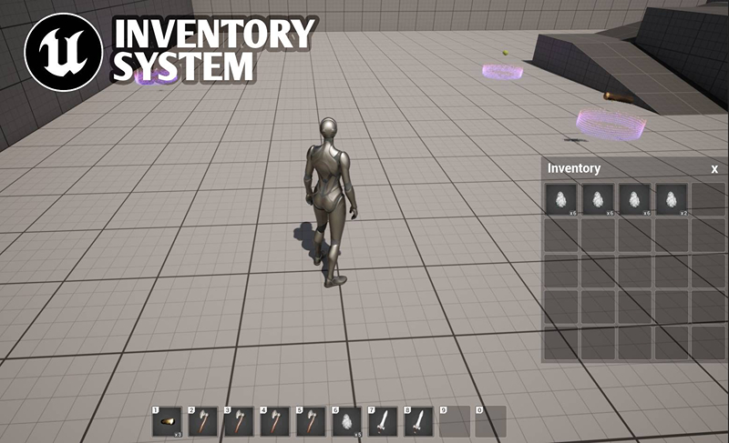
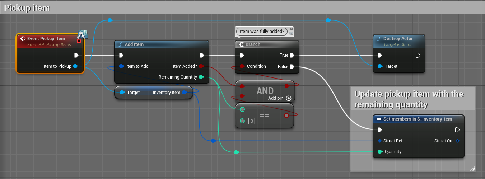
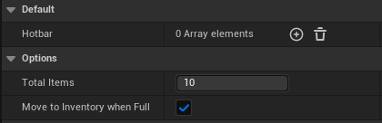
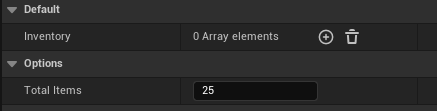
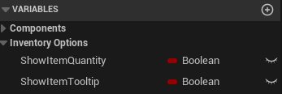

# Hotbar and Inventory System

[](https://youtu.be/pV__3HpuUho)

This is a drag-and-drop inventory system for Unreal Engine 5, the following features are currently implemented:
- Modular system.
- Hotbar and Inventory are fully customizable.
- Drag and drop items within Hotbar or Inventory or between them. It comes with example items for testing.
- Drag and drop items from Hotbar or Inventory into the level.
- Supports item stacking: Players can drag and drop stackable items onto each other to combine them into a single stack. This allows for more efficient inventory management and reduces clutter in the Inventory and Hotbar.
- Using the new Enhanced Input.
- Icon Generator tool. Useful for creating icons out of static meshes without using external applications.
- Made using Blueprints only!


## Installation
1. Download and install Git client https://git-scm.com
2. Download and install Git LFS https://git-lfs.com
3. Run this command in the terminal:
    ```git lfs install```
4. Clone the repo.

## Usage
This project is a standard Third Person Template, all the Inventory relative files are available in the InventorySystem folder under Content.
To test Item Pickups, I've added the BPI_PickupItems interface and Pickup Item event implementation to BP_ThirdPersonCharacter as follows:




### To use the system, do the following:
1. Add your item types to the E_ItemType enum (InventorySystem/Enums).
2. Update the DT_PickupItems data table (InventorySystem/DataTables) with your items:
    - Icon filed type is a texture2d. You can use the tool Icon Generator to create the icon.
    - Model field type is a static mesh.
    - Quantity field can be ignored here. It can be set when the PickupItem actor is added to the level.
    - Stackable field. How to handle the item, either individually or as a bulk.
    - MaxStack field. There is no stack limit if this field is set to zero, otherwise, the stack limit will be enforced.
    - AddToHotbar field. Where to add the item, if set to False, the item will be added to the Inventory instead.
3. Select Hotbar or Inventory component in BP_CorePlayerController blueprint ((InventorySystem/Blueprints) to configure it:

    __Hotbar options:__
    
    
    
    - Keep the Hotbar array empty, it will be populated automatically during gameplay.
    - Total Items. How many Hotbar items to show (max: 10 items).
    - Move to Inventory when Full. Picked-up items will be added to the Inventory if Hotbar is full.

    __Inventory options:__

    
    
    - Keep the Inventory array empty, it will be populated automatically during gameplay.
    - Total Items. How many Inventory items to show?

    __Global Inventory options:__
    
    

    - ShowItemQuantity. Show or hide quantity.
    - ShowItemTooltip. Show or hide the tooltip.
    

4. Add BP_ItemPickup (InventorySystem/Collectables) to the level and set the item and quantity.

## Additional details:
- Hotbar and Inventory are components attached to the Player controller for separation of responsibilities. The main purpose is to create a more modular, flexible, and maintainable inventory system that can be easily extended and customized to fit your game's specific needs.
- The system stores items as structures in a data table, which are essentially a table of data that can be accessed and manipulated in Blueprints. The DT_PickupItems contains information on each item in the inventory, such as its icon, model, stackability, and maximum stack size.
- The drag-and-drop feature allows users to move items between the Hotbar and Inventory, as well as to and from the game world. When dragging an item, the system will show a preview of the item's icon to give the user feedback on what they're dragging.
- For stackable items, the system will keep track of the quantity of each item in a stack and update the item's UI accordingly. If an item is picked up that would exceed the maximum stack size, the system will create a new stack for the remaining items.
- The Icon Generator tool uses Unreal Engine's Scene Capture component to capture a screenshot of a static mesh and convert it into a texture2D asset that can be used as an icon for the item. This can be useful for creating unique icons for custom items without having to use external image editing software.

## Todos
- Implement item splitting.
- Saving and loading the inventory.
- Support Network Replication.

## Credits
Item models were downloaded from https://opengameart.org

